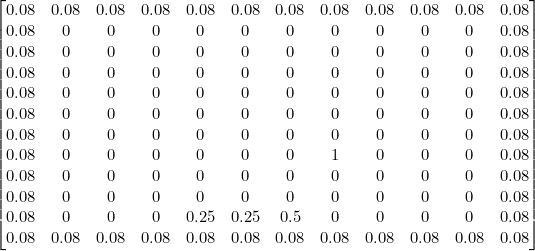

# Smart_Snake
In this project, Agent(snake) learns how to play the game.
The game board is 12&times;12 and the learning algorithm is DQN.
###### Maximum achieved score : 49

<table>
  <tr>
    <td> </td>
    <td> </td>
   </tr> 
   <tr> 
      <td align="center"><b>score = 49</b></td>
      <td align="center"><b>score = 49</b></td>
  </tr>
</table>

<table>
  <tr>
    <td> </td>
    <td> </td>
    <td> </td>
   </tr> 
   <tr> 
      <td align="center"><b>score = 48</b></td>
      <td align="center"><b>score = 46</b></td>
      <td align="center"><b>score = 43</b></td>
  </tr>
</table>

# Algorithm

| | 
|:--:| 
| *DQN Pseudo Code (https://storage.googleapis.com/deepmind-media/dqn/DQNNaturePaper.pdf)* |

###### Q = Q&theta; = Action-Value Function = Policy network
###### Q^ = Q&theta;- = Target Function = Target network
### Note:

#### The implementation has some differences with the above algorithm:

1. ##### The training (calculating loss and updating the weights) doesn't apply on the first 2000 steps.
   - ###### Because there is not enough samples in the replay memory.

2. ##### Target Network updates every C episodes (not every C steps).

# Network
#### Input Data :
###### &nbsp; **(Batch_size, 8)**

#### Layers  : 
###### &nbsp; **FC(1024)** &rarr; **ReLU** &rarr; **FC(1024)** &rarr; **ReLU** &rarr; **FC(512)** &rarr; **ReLU** &rarr; **FC(4)** 

# State
### st : 
&nbsp; Frame of the game after t transitions.
##### Example:
| | 
|:--:| 
| (12 &times; 12) Np array |

### &phi;(st) :
&nbsp; 8 features extracted from the frame as below:
##### &nbsp; [Adjoining_wall_x, Adjoining_wall_y, food_dir_x, food_dir_y, Adjoining_body_top, Adjoining_body_bottom, Adjoining_body_left, Adjoining_body_right]

&nbsp;&nbsp;&nbsp;&nbsp;&nbsp; 

&nbsp;&nbsp;&nbsp;&nbsp;&nbsp; 

&nbsp;&nbsp;&nbsp;&nbsp;&nbsp; 
 
&nbsp;&nbsp;&nbsp;&nbsp;&nbsp; 

&nbsp;&nbsp;&nbsp;&nbsp;&nbsp; 

&nbsp;&nbsp;&nbsp;&nbsp;&nbsp; 

&nbsp;&nbsp;&nbsp;&nbsp;&nbsp; 

&nbsp;&nbsp;&nbsp;&nbsp;&nbsp; 
##### &phi;(st) for the above example:
&nbsp;&nbsp;&nbsp;

# Hyperparameters
- #### C: 
   - ###### 10
- #### &gamma;: 
   - ###### 0.99
- #### Batch size : 
   - ###### 128
- #### actions : 
   - ###### (Left, Right, Up, Down) ~ (0, 1, 2, 3)
- #### Rewards : 
   - ###### (RewardFood , RewardLoose , RewardMove) ~ (100, -100, -0.1)
- #### N (Replay Memory Size) : 
   - ###### 50000
- #### M (Number of Episodes) : 
   - ###### 30000
- #### Learning rate : 
   - ###### 0.001
- #### Optimizer : 
   - ###### RMSprop
   
# Result 

##### Plots:
| |  | 
|:--|--:| 
| 
Train
 |<b>
Test
</b> |

#### Notices :
###### &nbsp;&nbsp; Training finished in ~ 209 Minutes on Tesla V100-SXM2-16GB(using google colab pro).
###### &nbsp;&nbsp; Test Result: &nbsp;&nbsp;<b>Mean(scores)</b> : 20.257&nbsp;&nbsp;|   <b>Std(scores)</b> : 6.50

# References

[1]  [CS440/ECE448 Spring 2019 Assignment 4: Reinforcement Learning and Deep Learning (illinois)](https://courses.engr.illinois.edu/cs440/sp2019/mp4/index.html)

[2]  [https://www.diva-portal.org/smash/get/diva2:1342302/FULLTEXT01.pdf](https://www.diva-portal.org/smash/get/diva2:1342302/FULLTEXT01.pdf)

[3]  [PyTorch - REINFORCEMENT LEARNING (DQN) TUTORIAL](https://pytorch.org/tutorials/intermediate/reinforcement_q_learning.html)
# Useful Resources
[Mnih, V., Kavukcuoglu, K., Silver, D., Graves, A., Antonoglou, I., Wierstra, D., & Riedmiller, M. (2013). Playing atari with deep reinforcement learning. arXiv preprint arXiv:1312.5602.](https://www.cs.toronto.edu/~vmnih/docs/dqn.pdf)

[AI learns to play SNAKE using Reinforcement Learning (Square Robots)](https://www.youtube.com/watch?v=8cdUree20j4)

[How to automate Snake using Reinforcement Learning (DeKay Arts)](https://www.youtube.com/watch?v=RMTfNPKnxhk)

[https://github.com/YuriyGuts/snake-ai-reinforcement/](https://github.com/YuriyGuts/snake-ai-reinforcement/)

[https://github.com/benjamin-dupuis/DQN-snake](https://github.com/benjamin-dupuis/DQN-snake)

 
